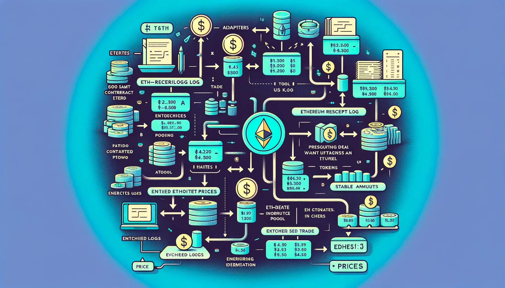

# EthResolveLogService



Ethereum Pool Service serves as a router for Parsing and Enriching event logs. The idea here is to have 
service where all possible enriching adapters are initialized, so we have inventory of events signatures 
and metadata(deployment <-> abi matching) which we are matching against logs in the batch.  

## Architecture
The service's core components are:

* EthResolveLogService: Initializes all enabled adapters, by loading them from./dex, manages an inventory of Ethereum
smart contract events, and orchestrates the parsing and resolving of blockchain logs. From LOG to Trade in current case.

* ContractAdaptersFactory: This factory class is responsible for creating instances of different adapters 
(DEX clients for example) classes based on the Namespace/Automated Market Maker (AMM) type calculated from
events matching and additional calls to blockchain if needed (Factory resolve in Uniswap for ex). 

## Event Parsing and Resolution
1. We parse Ethereum receipt logs (EthReceiptLog) and extract structured information from them (ParsedReceiptLog). 
This parsing process involves matching logs against a pre-built inventory of smart contract events to 
identify right adapter to use.
2. Once a log is parsed, the service can resolve it further to extract DEX-specific data like trades (
EthDexTrade), pool information (EthDexPool) and token information.
3. The service feeds obtained data into enricher, so we would have enriched Trade as result.
4. Enriched Trades creating EthDexPrice records as result of materialized view.
5. Those records are used to calculate prices for each token in the pool and enriching EthDexTrade with 
stable amounts and usd_prices which results in new EthDexPrice record posted.

# EthDexPrice

EthDexPrice is a class that represents a price of a token in a DEX. It has the following properties:
```
class EthDexPrice:
    pool_address: Address of the pool
    token_address: Address of the token
    price_usd: Price usd of the token in the pool
    reserve: reserve of token in the pool
    block_number: Block number of the event
    log_index: Log index of the event
```

EthDexPrice is produced as result of Materialized View working from Trades table, where we have last 
trade for each pool piped into EthDexPrice table with key of token_address,pool_address order by timestamp

EthDexPool enriched with pools_count data is used to identify base token for prices calculation. After base
token is identified we are polling EthDexPrice table for the price we can use for calculation.
There we apply all the filters needed on reserves, removing biased prices usd and so on (linear regression in CH?)
so as result we are getting price_usd for base token which we can trust and calculating price_usd for each token 
in the pool using relative price and enriching EthDexTrade with stable amounts and usd_prices which results in new EthDexPrice record posted in RocksDB as 
result of materialized view.

## Stablecoins

1. Stablecoins are listed in Chain entity which is loaded from Chains service. When we are calculating prices
and one of the stablecoins is in the pool we are setting price_usd = 1.

2. As second phase we would need to improve it here in cross-stablecoins prices:
* the one can be set ti 1, which participates with more of the pools.
* have biggest liquidity/volume ?
* combinations of both.

## Native Tokens

1. Native tokens are listed in Chain entity which is loaded from Chains service. 
2. When we are calculating prices and one of the native tokens is in the pool we are setting price_native = 1.

